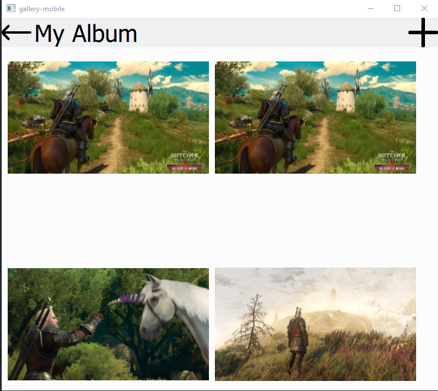

# Qt C++ Reference Projects

1. [ch02-sysinfo](/projects/ch02-sysinfo) : ("кроссплатформенное" приложение для мониторинга нагрузки на ЦПУ и память на виджетах)
   

2. [ch-03-gallery-core](/projects/ch03-gallery-core/) (библиотека бизнес-логики для приложения галереи картинок, основана на SQLite)
3. [gallery-desktop](/projects/ch03-gallery-core/gallery-deskptop/) (gui на виджетах, основанный на архитектуре Model-ViewController)
   
4. [gallery-mobile](projects\ch03-gallery-core\gallery-mobile) (gui на QML, основанный на StackView)
   
5. Многопоточное приложение (в разработке)